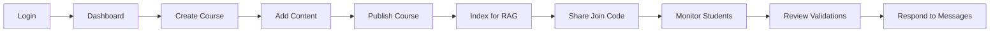
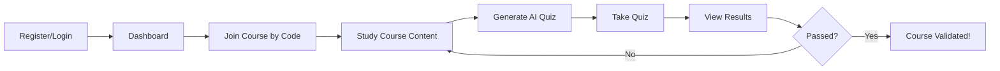

<p align="center">
  
  
  
  
</p>

<h1 align="center">🎓 Intelligent Pedagogical Platform</h1>

<p align="center">
  <strong>A production-grade educational platform integrating Spring Boot with LLM, RAG, and Agentic AI</strong>
</p>

<p align="center">
  <a href="#-features">Features</a> •
  <a href="#-quick-start">Quick Start</a> •
  <a href="#-project-structure">Project Structure</a> •
  <a href="#-api-endpoints">API</a> •
  <a href="#-ai-architecture">AI Architecture</a>
</p>

---

## 📋 Table of Contents

- [Overview](#-overview)
- [Features](#-features)
- [Technology Stack](#️-technology-stack)
- [Project Structure](#-project-structure)
- [Quick Start](#-quick-start)
- [Demo Credentials](#-demo-credentials)
- [User Guide](#-user-guide)
- [AI Architecture](#-ai-architecture)
- [API Endpoints](#-api-endpoints)
- [Configuration](#️-configuration)
- [Database Schema](#-database-schema)
- [Security](#-security)
- [Screenshots](#-screenshots)
- [Future Enhancements](#-future-enhancements)
- [Contributing](#-contributing)
- [License](#-license)

---

## 🎯 Overview

An **intelligent, secure educational platform** that combines classical Spring Boot architecture with cutting-edge AI technologies:

| Component | Description |
|-----------|-------------|
| **🤖 Large Language Models (LLM)** | AI-powered quiz generation using Groq API |
| **📚 Retrieval-Augmented Generation (RAG)** | Content-based questions derived from course materials |
| **🧠 Agentic AI Supervisor** | Intelligent decision-making for quiz difficulty and evaluation |
| **💬 Messaging System** | Student-Teacher communication platform |
| **🔐 Role-Based Access** | Secure authentication for Admins and Students |

---

## ✨ Features

### 👨‍💼 For Administrators

| Feature | Description |
|---------|-------------|
| 📚 **Course Management** | Create, edit, publish, and manage courses |
| 👥 **Student Management** | View and manage student accounts |
| 🔗 **Enrollment System** | Manage course enrollments with join codes |
| 🤖 **RAG Indexing** | Trigger AI indexing for quiz generation |
| 📊 **Dashboard Analytics** | View platform statistics and usage |
| ✅ **Course Validation** | AI-recommended, admin-approved course validation |
| 💬 **Messaging Inbox** | Receive and respond to student messages |

### 👨‍🎓 For Students

| Feature | Description |
|---------|-------------|
| 📝 **Self-Registration** | Create your own account to join the platform |
| 🔑 **Join by Code** | Enroll in courses using unique join codes |
| 📖 **Course Access** | Access enrolled courses and read content |
| 🧠 **AI Quiz Generation** | Generate personalized, adaptive quizzes |
| ✅ **Quiz Taking** | Take timed quizzes with multiple-choice questions |
| 📈 **Progress Tracking** | View quiz history, scores, and validation progress |
| 💬 **Contact Teachers** | Send messages to course administrators |

### 🤖 AI Intelligence Features

| Feature | Description |
|---------|-------------|
| **Adaptive Difficulty** | AI adjusts quiz difficulty based on student performance |
| **RAG-Based Content** | Questions derived exclusively from course material |
| **Intelligent Evaluation** | AI agent makes pedagogical pass/fail decisions |
| **Personalized Feedback** | Contextual feedback based on performance |
| **Quiz Duration Calculation** | Precise timing based on question count and difficulty |

---

## 🛠️ Technology Stack

### Backend

| Technology | Version | Purpose |
|------------|---------|---------|
| Spring Boot | 3.2.0 | Application framework |
| Spring Security | 6.x | Authentication & Authorization |
| Spring Data JPA | 3.x | Data persistence |
| H2 Database | 2.x | In-memory database |
| Lombok | 1.18.x | Boilerplate code reduction |
| Bean Validation | 3.x | Input validation |

### Frontend

| Technology | Purpose |
|------------|---------|
| Thymeleaf | Server-side templating |
| Thymeleaf Extras Security | Spring Security integration |
| Bootstrap | UI styling (via CDN) |

### AI & LLM

| Technology | Purpose |
|------------|---------|
| Groq API | LLM for quiz generation |
| Custom RAG | Content retrieval system |
| Agentic AI | Intelligent supervision |

### Build Tools

| Tool | Purpose |
|------|---------|
| Maven | Dependency management |
| Maven Wrapper | Consistent builds |

---

## 📁 Project Structure

```
PROJET_JAVA/
├── 📂 src/
│   └── 📂 main/
│       ├── 📂 java/com/ensam/ma/
│       │   ├── 📂 config/              # Configuration classes
│       │   │   ├── AgentConfig.java         # AI agent configuration
│       │   │   ├── DataInitializer.java     # Sample data initialization
│       │   │   └── SecurityConfig.java      # Spring Security setup
│       │   │
│       │   ├── 📂 controller/          # REST & MVC Controllers
│       │   │   ├── AdminController.java     # Admin endpoints
│       │   │   ├── AuthController.java      # Authentication (login/register)
│       │   │   ├── MainController.java      # Public endpoints
│       │   │   └── StudentController.java   # Student endpoints
│       │   │
│       │   ├── 📂 dto/                 # Data Transfer Objects
│       │   │   ├── QuizResponse.java        # Quiz submission response
│       │   │   ├── QuizSubmissionWrapper.java # Quiz answers wrapper
│       │   │   └── RegistrationDTO.java     # User registration data
│       │   │
│       │   ├── 📂 model/               # JPA Entities
│       │   │   ├── Course.java              # Course entity
│       │   │   ├── Enrollment.java          # Course enrollment
│       │   │   ├── EnrollmentStatus.java    # Enrollment status enum
│       │   │   ├── Message.java             # Student-Teacher messages
│       │   │   ├── Question.java            # Quiz question
│       │   │   ├── QuestionOption.java      # Question options
│       │   │   ├── QuizAttempt.java         # Quiz attempt tracking
│       │   │   ├── Role.java                # User roles enum
│       │   │   └── User.java                # User entity
│       │   │
│       │   ├── 📂 repository/          # Spring Data Repositories
│       │   │   ├── CourseRepository.java
│       │   │   ├── EnrollmentRepository.java
│       │   │   ├── MessageRepository.java
│       │   │   ├── QuestionRepository.java
│       │   │   ├── QuizAttemptRepository.java
│       │   │   └── UserRepository.java
│       │   │
│       │   ├── 📂 service/             # Business Logic Services
│       │   │   ├── AgenticAIService.java    # Agentic AI supervisor
│       │   │   ├── AgenticQuizSupervisor.java # Quiz supervision
│       │   │   ├── CourseService.java       # Course operations
│       │   │   ├── LLMService.java          # LLM integration (Groq)
│       │   │   ├── MessageService.java      # Messaging system
│       │   │   ├── QuizService.java         # Quiz operations
│       │   │   ├── RAGService.java          # RAG implementation
│       │   │   └── UserService.java         # User operations
│       │   │
│       │   ├── ProjetJavaApplication.java   # Main application class
│       │   └── ServletInitializer.java      # WAR deployment support
│       │
│       └── 📂 resources/
│           ├── 📂 templates/           # Thymeleaf templates
│           │   ├── 📂 admin/                # Admin pages
│           │   │   ├── 📂 courses/          # Course management
│           │   │   ├── 📂 messages/         # Message inbox
│           │   │   ├── 📂 students/         # Student management
│           │   │   ├── dashboard.html       # Admin dashboard
│           │   │   └── validations.html     # Course validations
│           │   │
│           │   ├── 📂 student/              # Student pages
│           │   │   ├── 📂 courses/          # Course views
│           │   │   ├── 📂 quiz/             # Quiz pages
│           │   │   └── dashboard.html       # Student dashboard
│           │   │
│           │   ├── login.html               # Login page
│           │   └── register.html            # Registration page
│           │
│           └── application.properties   # Application configuration
│
├── 📂 data/                        # H2 database files
├── pom.xml                         # Maven configuration
├── README.md                       # This file
└── TECHNICAL_DOCUMENTATION.md      # Detailed technical docs
```

---

## 🚀 Quick Start

### Prerequisites

- ☕ **Java 17** or higher
- 📦 **Maven 3.6+** (or use included Maven Wrapper)
- 🔑 **Groq API Key** (optional - has fallback demo mode)

### Installation

#### 1️⃣ Clone the Repository

```bash
git clone https://github.com/mohhajji-1111/PROJET_JAVA.git
cd PROJET_JAVA
```

#### 2️⃣ Configure API Key (Optional)

Set environment variable:

```bash
# Windows (PowerShell)
$env:GROQ_API_KEY="your-api-key-here"

# Windows (CMD)
set GROQ_API_KEY=your-api-key-here

# Linux/Mac
export GROQ_API_KEY=your-api-key-here
```

Or edit `src/main/resources/application.properties`:

```properties
groq.api.key=your-api-key-here
```

#### 3️⃣ Build and Run

```bash
# Using Maven Wrapper (recommended)
./mvnw clean install
./mvnw spring-boot:run

# Or using installed Maven
mvn clean install
mvn spring-boot:run
```

#### 4️⃣ Access the Application

| URL | Description |
|-----|-------------|
| http://localhost:8080 | Main application |
| http://localhost:8080/login | Login page |
| http://localhost:8080/register | Registration page |
| http://localhost:8080/h2-console | Database console |

---

## 🔐 Demo Credentials

### 👨‍💼 Administrator Account

| Field | Value |
|-------|-------|
| Username | `admin` |
| Password | `admin123` |

### 👨‍🎓 Student Accounts

| Username | Password |
|----------|----------|
| `john.doe` | `password` |
| `jane.smith` | `password` |
| `bob.wilson` | `password` |

> 💡 **Tip**: You can also create your own student account via the **Register** page!

---

## 📖 User Guide

### 👨‍💼 Administrator Workflow



**Step-by-Step:**

1. **Login** → Use admin credentials
2. **Dashboard** → View platform statistics
3. **Create Course** → Navigate to Courses → Create New
4. **Add Content** → Enter title, description, and comprehensive content
5. **Publish** → Make the course visible to students
6. **Index** → Enable RAG-based AI quiz generation
7. **Share Join Code** → Give students the unique course code
8. **Monitor** → Track student progress and quiz results
9. **Validate** → Review and approve AI-recommended course validations
10. **Messages** → Respond to student inquiries

### 👨‍🎓 Student Workflow



**Step-by-Step:**

1. **Register** → Create a new account (or login if existing)
2. **Dashboard** → View your enrolled courses
3. **Join Course** → Enter the join code provided by teacher
4. **Study** → Read the course content thoroughly
5. **Generate Quiz** → AI creates personalized questions
6. **Take Quiz** → Answer all questions within time limit
7. **View Results** → See score, correct answers, and feedback
8. **Retake if needed** → AI adapts difficulty based on performance

---

## 🤖 AI Architecture

### Agentic AI Flow

```
┌─────────────────────────────────────────────────────────────────┐
│                    STUDENT REQUESTS QUIZ                         │
└─────────────────────────────────────────────────────────────────┘
                                │
                                ▼
┌─────────────────────────────────────────────────────────────────┐
│              🧠 AGENTIC AI SUPERVISOR                            │
│  ┌──────────────────────────────────────────────────────────┐   │
│  │ 1. Analyze student's quiz history                         │   │
│  │ 2. Determine optimal difficulty (EASY/MEDIUM/HARD)        │   │
│  │ 3. Calculate question count (5/10/15)                     │   │
│  │ 4. Set quiz duration based on complexity                  │   │
│  └──────────────────────────────────────────────────────────┘   │
└─────────────────────────────────────────────────────────────────┘
                                │
                                ▼
┌─────────────────────────────────────────────────────────────────┐
│                    📚 RAG SERVICE                                │
│  ┌──────────────────────────────────────────────────────────┐   │
│  │ 1. Chunk course content (500 chars, 100 overlap)          │   │
│  │ 2. Create embeddings                                      │   │
│  │ 3. Query for relevant content                             │   │
│  │ 4. Return top-K most relevant chunks                      │   │
│  └──────────────────────────────────────────────────────────┘   │
└─────────────────────────────────────────────────────────────────┘
                                │
                                ▼
┌─────────────────────────────────────────────────────────────────┐
│                    🤖 LLM SERVICE (Groq)                         │
│  ┌──────────────────────────────────────────────────────────┐   │
│  │ 1. Receive RAG context + parameters                       │   │
│  │ 2. Generate quiz questions via Groq API                   │   │
│  │ 3. Return structured JSON with questions                  │   │
│  └──────────────────────────────────────────────────────────┘   │
└─────────────────────────────────────────────────────────────────┘
                                │
                                ▼
┌─────────────────────────────────────────────────────────────────┐
│                    📝 STUDENT TAKES QUIZ                         │
└─────────────────────────────────────────────────────────────────┘
                                │
                                ▼
┌─────────────────────────────────────────────────────────────────┐
│              🧠 AGENTIC AI EVALUATES                             │
│  ┌──────────────────────────────────────────────────────────┐   │
│  │ 1. Calculate score                                        │   │
│  │ 2. Apply pass threshold (70%)                             │   │
│  │ 3. Generate personalized feedback                         │   │
│  │ 4. Make PASS/FAIL decision                                │   │
│  │ 5. Recommend course validation to admin                   │   │
│  └──────────────────────────────────────────────────────────┘   │
└─────────────────────────────────────────────────────────────────┘
```

### Difficulty Adaptation Algorithm

```java
Algorithm:
├── Analyze last 3 quiz attempts for this course
├── Calculate average score
├── Adaptive decision:
│   ├── Score ≥ 80% → HARD (15 questions, 25 min)
│   ├── Score 60-79% → MEDIUM (10 questions, 15 min)
│   └── Score < 60% → EASY (5 questions, 10 min)
└── First attempt defaults to EASY
```

---

## 📡 API Endpoints

### 🔓 Public Endpoints

| Method | Endpoint | Description |
|--------|----------|-------------|
| GET | `/` | Home page |
| GET | `/login` | Login page |
| POST | `/login` | Process login |
| GET | `/register` | Registration page |
| POST | `/register` | Process registration |

### 👨‍💼 Admin Endpoints

| Method | Endpoint | Description |
|--------|----------|-------------|
| GET | `/admin/dashboard` | Admin dashboard |
| GET | `/admin/courses` | List all courses |
| GET | `/admin/courses/new` | Create course form |
| POST | `/admin/courses` | Save new course |
| GET | `/admin/courses/{id}` | View course details |
| GET | `/admin/courses/{id}/edit` | Edit course form |
| POST | `/admin/courses/{id}` | Update course |
| POST | `/admin/courses/{id}/publish` | Publish course |
| POST | `/admin/courses/{id}/index` | Index for RAG |
| GET | `/admin/students` | List all students |
| GET | `/admin/students/{id}` | View student details |
| GET | `/admin/validations` | Course validation queue |
| POST | `/admin/validations/{id}/approve` | Approve validation |
| GET | `/admin/messages` | Message inbox |
| GET | `/admin/messages/{id}` | View message |
| POST | `/admin/messages/{id}/reply` | Reply to message |

### 👨‍🎓 Student Endpoints

| Method | Endpoint | Description |
|--------|----------|-------------|
| GET | `/student/dashboard` | Student dashboard |
| GET | `/student/courses` | List enrolled courses |
| GET | `/student/courses/{id}` | View course details |
| POST | `/student/courses/join` | Join course by code |
| POST | `/student/courses/{id}/generate-quiz` | Generate AI quiz |
| GET | `/student/quiz/{id}` | Take quiz page |
| POST | `/student/quiz/{id}/submit` | Submit quiz answers |
| GET | `/student/quiz/{id}/results` | View quiz results |
| POST | `/student/courses/{id}/message` | Send message to teacher |

---

## ⚙️ Configuration

### Application Properties

```properties
# ═══════════════════════════════════════════
# SERVER CONFIGURATION
# ═══════════════════════════════════════════
server.port=8080

# ═══════════════════════════════════════════
# DATABASE CONFIGURATION
# ═══════════════════════════════════════════
spring.datasource.url=jdbc:h2:file:./data/schoolDB
spring.datasource.driverClassName=org.h2.Driver
spring.datasource.username=sa
spring.datasource.password=
spring.jpa.database-platform=org.hibernate.dialect.H2Dialect
spring.h2.console.enabled=true
spring.h2.console.path=/h2-console

# ═══════════════════════════════════════════
# AI/LLM CONFIGURATION (Groq)
# ═══════════════════════════════════════════
groq.api.key=${GROQ_API_KEY:your-api-key}
groq.api.url=https://api.groq.com/openai/v1/chat/completions
groq.model=llama-3.3-70b-versatile
groq.temperature=0.7
groq.max.tokens=2000

# ═══════════════════════════════════════════
# RAG CONFIGURATION
# ═══════════════════════════════════════════
rag.chunk.size=500
rag.chunk.overlap=100
rag.max.results=5

# ═══════════════════════════════════════════
# AGENTIC AI CONFIGURATION
# ═══════════════════════════════════════════
agent.quiz.questions.easy=5
agent.quiz.questions.medium=10
agent.quiz.questions.hard=15
agent.quiz.duration.easy=10
agent.quiz.duration.medium=15
agent.quiz.duration.hard=25
agent.pass.threshold=70
```

---

## 🗄️ Database Schema

```
┌──────────────────┐       ┌──────────────────┐
│      USER        │       │     COURSE       │
├──────────────────┤       ├──────────────────┤
│ id (PK)          │       │ id (PK)          │
│ username         │◄──────│ createdBy (FK)   │
│ password         │       │ title            │
│ fullName         │       │ description      │
│ email            │       │ content          │
│ role             │       │ joinCode         │
│ enabled          │       │ published        │
└────────┬─────────┘       │ indexed          │
         │                 └────────┬─────────┘
         │                          │
         │    ┌─────────────────────┤
         │    │                     │
         ▼    ▼                     ▼
┌──────────────────┐       ┌──────────────────┐
│   ENROLLMENT     │       │   QUIZ_ATTEMPT   │
├──────────────────┤       ├──────────────────┤
│ id (PK)          │       │ id (PK)          │
│ student (FK)     │       │ student (FK)     │
│ course (FK)      │       │ course (FK)      │
│ status           │       │ difficulty       │
│ enrolledAt       │       │ score            │
│ validatedAt      │       │ passed           │
└──────────────────┘       │ duration         │
                           │ agentDecision    │
                           │ feedback         │
                           │ completedAt      │
                           └────────┬─────────┘
                                    │
                                    ▼
                           ┌──────────────────┐
                           │    QUESTION      │
                           ├──────────────────┤
                           │ id (PK)          │
                           │ quizAttempt (FK) │
                           │ questionText     │
                           │ correctOption    │
                           │ selectedAnswer   │
                           │ explanation      │
                           └────────┬─────────┘
                                    │
                                    ▼
                           ┌──────────────────┐
                           │ QUESTION_OPTION  │
                           ├──────────────────┤
                           │ id (PK)          │
                           │ question (FK)    │
                           │ optionNumber     │
                           │ optionText       │
                           └──────────────────┘

┌──────────────────┐
│     MESSAGE      │
├──────────────────┤
│ id (PK)          │
│ sender (FK)      │
│ recipient (FK)   │
│ course (FK)      │
│ subject          │
│ content          │
│ read             │
│ sentAt           │
└──────────────────┘
```

---

## 🔒 Security

### Role-Based Access Control (RBAC)

```
┌─────────────────────────────────────────────────────────────┐
│                    ROLE_ADMINISTRATOR                        │
├─────────────────────────────────────────────────────────────┤
│ ✅ Full access to /admin/** endpoints                       │
│ ✅ Create, update, delete courses                           │
│ ✅ Manage student accounts                                  │
│ ✅ Trigger RAG indexing                                     │
│ ✅ View global statistics                                   │
│ ✅ Approve course validations                               │
│ ✅ Read and respond to messages                             │
└─────────────────────────────────────────────────────────────┘

┌─────────────────────────────────────────────────────────────┐
│                      ROLE_STUDENT                            │
├─────────────────────────────────────────────────────────────┤
│ ✅ Access to /student/** endpoints                          │
│ ✅ View enrolled courses only                               │
│ ✅ Generate AI quizzes                                      │
│ ✅ Take quizzes and view results                            │
│ ✅ Send messages to teachers                                │
│ ❌ No modification rights                                   │
│ ❌ Cannot access admin pages                                │
└─────────────────────────────────────────────────────────────┘
```

### Security Features

| Feature | Implementation |
|---------|----------------|
| **Authentication** | Form-based login with BCrypt password hashing |
| **Authorization** | Method-level security with `@PreAuthorize` |
| **CSRF Protection** | Enabled for all state-changing operations |
| **Session Management** | Secure session handling with automatic invalidation |
| **Password Encoding** | BCrypt with strength 10 |

---

## 📸 Screenshots

> 🖼️ *Screenshots will be added here showing the key pages:*
> - Login Page
> - Admin Dashboard
> - Student Dashboard
> - Course View
> - Quiz Taking Interface
> - Results Page

---

## 🔮 Future Enhancements

| Enhancement | Description |
|-------------|-------------|
| 📄 **Multi-Format RAG** | Support for PDF, images, and videos |
| 📊 **Advanced Analytics** | Detailed dashboards with performance insights |
| 🏆 **Certifications** | Automatic certificate generation |
| 🌍 **Multi-Language** | Internationalization support |
| 🤝 **LMS Integration** | Connect with Moodle, Canvas, etc. |
| 🎮 **Gamification** | Badges, leaderboards, achievements |
| 💬 **Real-time Chat** | Live student-teacher communication |
| 📱 **Mobile App** | iOS and Android applications |

---

## 🤝 Contributing

This is an educational demonstration project. To contribute:

1. **Fork** the repository
2. **Create** a feature branch (`git checkout -b feature/amazing-feature`)
3. **Commit** your changes (`git commit -m 'Add amazing feature'`)
4. **Push** to the branch (`git push origin feature/amazing-feature`)
5. **Open** a Pull Request

### Development Guidelines

- Follow the layered architecture pattern
- Add tests for new features
- Document AI decision logic
- Update configuration as needed

---

## 📚 Documentation

For more detailed technical documentation, see:

- 📖 [TECHNICAL_DOCUMENTATION.md](TECHNICAL_DOCUMENTATION.md) - In-depth architecture and implementation details

---

## 📄 License

This project is developed for **educational and demonstration purposes**.

---

## 🙏 Acknowledgments

Developed as a comprehensive demonstration of:

- ✅ Spring Boot expertise
- ✅ Spring Security implementation
- ✅ AI integration (LLM + RAG + Agentic AI)
- ✅ Clean architecture principles
- ✅ Production-ready development practices

---

<p align="center">
  <strong>🎓 This is education, intelligently automated. 🚀</strong>
</p>

<p align="center">
  Made with ❤️ using Spring Boot and AI
</p>
